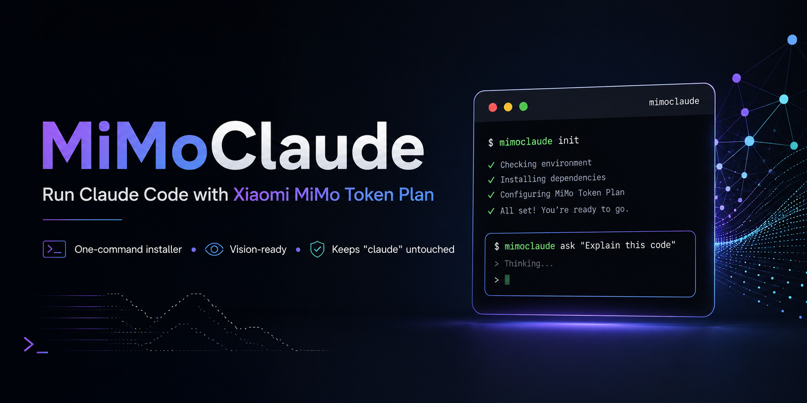

<p align="center">
  
</p>

# MiMoClaude

MiMoClaude is a small open-source installer that creates a separate `mimoclaude` command for Claude Code. It runs the normal `claude` command with Anthropic-compatible environment variables for Xiaomi MiMo.

MiMoClaude does not replace or modify your normal `claude` command.

## Install on macOS or Linux

```bash
curl -fsSL https://raw.githubusercontent.com/ahmadghaisanfad2/mimoclaude/main/install.sh | bash
```

## Install on Windows

Run this in PowerShell:

```powershell
iwr -useb https://raw.githubusercontent.com/ahmadghaisanfad2/mimoclaude/main/install.ps1 | iex
```

The installer will ask which MiMo API type you use, then ask for your MiMo API key and store the config locally at:

```text
~/.mimoclaude/config
```

On Windows, this means:

```text
%USERPROFILE%\.mimoclaude\config
```

On macOS and Linux, the config file is created with `chmod 600`. On Windows, the installer tries to restrict the config file to your current Windows user.

During install, choose one of these API types:

- Token Plan: uses `https://token-plan-sgp.xiaomimimo.com/anthropic`
- API Pay-as-you-go: asks you to paste your MiMo Anthropic-compatible API base URL

Token Plan keys usually start with `tp-`. If a Token Plan key does not start with `tp-`, the installer shows a warning and asks whether to continue. API Pay-as-you-go keys may use a different prefix.

## Usage

```bash
mimoclaude
```

You can pass Claude Code arguments the same way:

```bash
mimoclaude --help
```

## Model Mapping

MiMoClaude configures Claude Code with these Anthropic-compatible model variables:

- main model: `mimo-v2.5-pro`
- sonnet: `mimo-v2.5`
- opus: `mimo-v2.5-pro`
- haiku/vision: `mimo-v2.5`

## Uninstall

macOS or Linux:

```bash
curl -fsSL https://raw.githubusercontent.com/ahmadghaisanfad2/mimoclaude/main/uninstall.sh | bash
```

Windows PowerShell:

```powershell
iwr -useb https://raw.githubusercontent.com/ahmadghaisanfad2/mimoclaude/main/uninstall.ps1 | iex
```

The uninstaller removes:

- `~/bin/mimoclaude`
- `~/.mimoclaude`

On Windows, it removes:

- `%USERPROFILE%\bin\mimoclaude.cmd`
- `%USERPROFILE%\bin\mimoclaude.ps1`
- `%USERPROFILE%\.mimoclaude`

It does not automatically remove PATH entries from `.zshrc`, `.bashrc`, `.profile`, or Windows user environment variables.

## Security Notes

- Your API key is stored locally.
- Your selected API type and base URL are stored locally.
- On macOS and Linux, the config file uses `chmod 600`.
- On Windows, the installer tries to restrict the config file to your current Windows user.
- Do not share your `~/.mimoclaude/config` or `%USERPROFILE%\.mimoclaude\config` file.
- Bypass permission is intentionally not enabled by default.
- MiMoClaude does not modify `~/.claude/settings.json`.
